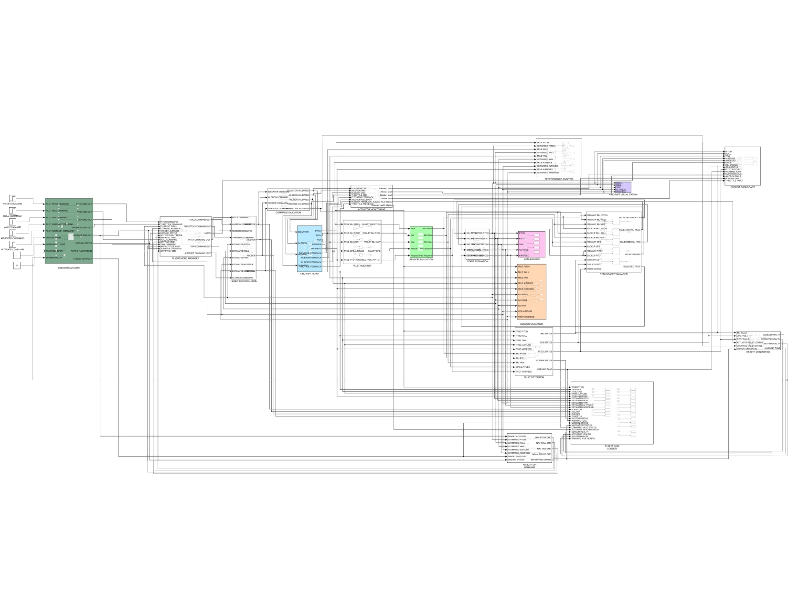

# Integrated Flight Control Computer (IFCC) Simulation

> MATLAB/Simulink implementation of an Integrated Flight Control Computer (IFCC) featuring flight control laws, sensor fusion, Extended Kalman Filter (EKF) based state estimation, flight mode management, fault detection, redundancy management, actuator control, and real-time cockpit monitoring.


---

## Project Overview

This project presents a modular **Integrated Flight Control Computer (IFCC)** developed in **MATLAB/Simulink** to demonstrate the architecture and functionality of modern digital aircraft flight-control systems.

The IFCC integrates **aircraft sensor processing, state estimation, flight control laws, flight mode management, actuator command generation, fault detection, and redundancy management** into a unified real-time simulation environment.

The project is designed to demonstrate embedded aerospace control concepts used in **fly-by-wire flight-control systems**, while maintaining a modular architecture suitable for further development, validation, and hardware implementation.

---

## Key Features

* Integrated Flight Control Computer architecture
* Extended Kalman Filter (EKF) based state estimation
* IMU, GNSS, and Pitot sensor fusion
* Aircraft state monitoring
* Flight control law implementation
* Flight Mode Manager
* Manual and automatic flight-control modes
* Actuator command generation
* Fault Detection and Isolation (FDI)
* Sensor health monitoring
* Redundancy management
* Sensor fault injection
* Real-time cockpit monitoring
* Flight data logging
* Aircraft visualization
* RMSE-based performance evaluation

---

## System Architecture

<p align="center">
  
</p>

The IFCC is organized as a modular flight-control architecture consisting of aircraft dynamics, sensor processing, state estimation, flight-control logic, fault management, actuator control, and cockpit monitoring.

The architecture separates sensing, estimation, decision-making, control, and monitoring functions to provide a structured representation of a modern aerospace embedded control system.

---

## Project Structure

```text
Integrated-Flight-Control-Computer-Simulation
│
├── Simulink_Model/
│      IFCC_Simulation.slx
│
├── MATLAB/
│      run_simulation.m
│      calculate_rmse.m
│      plot_results.m
│
├── Images/
│      Architecture.png
│      CockpitDashboard.png
│      EKF.png
│      FaultDetection.png
│      FlightModes.png
│      FlightControl.png
│
├── Results/
│      NormalFlight.png
│      FaultInjection.png
│      RMSE.png
│
├── Documentation/
│      Project_Report.pdf
│
├── README.md
├── LICENSE
└── .gitignore
```

---

## System Components

### Aircraft Plant

Provides the simulated aircraft dynamics and generates the reference flight states used for closed-loop flight-control evaluation.

The aircraft model provides parameters such as:

* Pitch
* Roll
* Yaw
* Altitude
* Airspeed
* Angular rates
* Aircraft position

---

### Sensor Simulation

Simulates aircraft sensor measurements with configurable noise, bias, and faults.

The system includes:

* IMU
* GNSS
* Pitot Tube

The sensor subsystem generates realistic measurement variations that are processed by the IFCC before being used by the flight-control system.

---

### State Estimation

An **Extended Kalman Filter (EKF)** estimates the aircraft state from noisy sensor measurements.

The EKF combines information from multiple sensors to provide a more reliable estimate of the aircraft's:

* Attitude
* Position
* Altitude
* Airspeed
* Angular states

The estimated states are subsequently used by the flight-control algorithms.

---

### Integrated Flight Control Computer

The central IFCC subsystem processes estimated aircraft states and generates appropriate control commands.

The IFCC performs:

1. Sensor data processing
2. State estimation
3. Flight-mode selection
4. Flight-control computation
5. Fault monitoring
6. Sensor redundancy management
7. Actuator command generation

This provides a unified representation of an aircraft flight-control computer.

---

### Flight Control Laws

The flight-control subsystem generates control commands based on aircraft state estimates and selected flight modes.

The controller supports closed-loop control of aircraft states such as:

* Pitch
* Roll
* Yaw
* Altitude
* Airspeed

The architecture can be extended with advanced control strategies such as LQR, MPC, or gain-scheduled control.

---

### Flight Mode Manager

The Flight Mode Manager determines the active aircraft control mode.

Supported modes include:

* Manual Flight
* Pitch Hold
* Altitude Hold

The active mode determines the corresponding flight-control logic and control objectives.

---

### Fault Detection and Isolation

The fault-management subsystem continuously monitors sensor measurements and system status.

It detects abnormal sensor behavior using threshold-based monitoring and consistency checks.

Supported fault scenarios include:

* IMU failure
* GNSS failure
* Pitot failure
* Sensor measurement deviation
* Sensor signal loss

---

### Redundancy Management

The Redundancy Manager maintains system operation during sensor failures.

When a faulty sensor is detected:

1. The sensor health status is updated.
2. The faulty measurement is isolated.
3. Backup or alternate measurements are selected.
4. Valid measurements continue to be supplied to the estimation and control system.

This demonstrates a simplified form of fault-tolerant aerospace control architecture.

---

### Actuator Interface

The actuator-control subsystem converts flight-control commands into simulated actuator inputs.

The actuator interface represents control surfaces such as:

* Elevator
* Aileron
* Rudder

The subsystem can be extended to include actuator saturation, rate limits, failures, and dynamic actuator models.

---

### Cockpit Dashboard

The cockpit dashboard provides real-time visualization of the aircraft and IFCC status.

Displayed parameters include:

* Pitch
* Roll
* Yaw
* Altitude
* Airspeed
* Flight Mode
* Sensor Health
* Fault Status
* Warning Status
* Control Commands

<p align="center">
  
</p>

---

## Fault Injection

The simulation includes controlled fault-injection scenarios to evaluate the robustness of the IFCC.

### Supported Faults

* IMU Failure
* GNSS Failure
* Pitot Failure
* Sensor measurement corruption
* Sensor signal loss

The fault-management architecture detects the abnormal measurement and activates the corresponding redundancy-management response.

This enables evaluation of the system under both **nominal and degraded operating conditions**.

---

## Validation

The IFCC simulation is evaluated using **Root Mean Square Error (RMSE)** between reference aircraft states and estimated states.

| State    |    RMSE |
| -------- | ------: |
| Pitch    | 0.00599 |
| Roll     | 0.00626 |
| Yaw      | 0.00480 |
| Altitude | 0.01427 |
| Airspeed | 0.01833 |

The low estimation error demonstrates effective sensor fusion and EKF-based state estimation within the simulated flight-control architecture.

---

## Simulation Workflow

```text
Aircraft Dynamics
       │
       ▼
Sensor Simulation
       │
       ├── IMU
       ├── GNSS
       └── Pitot
       │
       ▼
Sensor Validation
       │
       ▼
Fault Detection
       │
       ▼
Redundancy Management
       │
       ▼
EKF State Estimation
       │
       ▼
Flight Mode Manager
       │
       ▼
Flight Control Laws
       │
       ▼
Actuator Commands
       │
       ▼
Aircraft Plant
       │
       └────────────── Feedback ──────────────┘
```

---

## Performance Evaluation

The simulation provides quantitative performance analysis using:

* State-estimation RMSE
* Reference vs. estimated states
* Sensor fault response
* Fault detection response
* Flight-mode transitions
* Control-command behavior
* System response during degraded sensor operation

Results can be generated using the MATLAB analysis scripts included in the project.

---

## Technologies

* MATLAB
* Simulink
* Control Systems
* Extended Kalman Filter (EKF)
* Sensor Fusion
* Flight Dynamics
* Fault Detection and Isolation
* Redundancy Management
* Aerospace Embedded Systems
* Digital Flight Control
* Closed-Loop Control

---

## How to Run

### 1. Open MATLAB

Open the project directory in MATLAB.

### 2. Open the Simulink Model

Open:

```text
Simulink_Model/IFCC_Simulation.slx
```

### 3. Run the Simulation

Execute:

```matlab
run_simulation
```

### 4. Calculate RMSE

Execute:

```matlab
calculate_rmse
```

### 5. Plot Results

Execute:

```matlab
plot_results
```

The generated results can be stored in the `Results/` directory.

---

## Example Results

### Normal Flight

<p align="center">
  
</p>

### Fault Injection

<p align="center">
  
</p>

### RMSE Analysis

<p align="center">
  
</p>

---

## Engineering Concepts Demonstrated

This project demonstrates practical understanding of:

* Aerospace embedded systems
* Fly-by-wire control architecture
* Real-time control systems
* Sensor fusion
* State estimation
* Kalman filtering
* Fault-tolerant systems
* Redundancy management
* Flight-control algorithms
* Closed-loop feedback systems
* Simulation-based verification
* System-level validation

---

## Future Improvements

* Full nonlinear 6-DOF aircraft dynamics
* Triple-redundant flight-control architecture
* Multi-sensor voting and monitoring
* Advanced sensor fault isolation
* Adaptive Kalman filtering
* LQR flight-control laws
* Model Predictive Control (MPC)
* Gain-scheduled flight-control laws
* Actuator failure simulation
* Hardware-in-the-Loop (HIL) testing
* Automatic code generation
* Embedded C implementation
* AUTOSAR-compatible software architecture
* Real-time target deployment
* DO-178C-oriented verification workflow

---

## Author

**HARISH RAJI GOVINDARASSOU**
**&**
**DHANUSRI VEERAPPAN**

Master's Students – Embedded Systems

Electronics and Communication Engineering

---

## License

This project is released under the MIT License.
